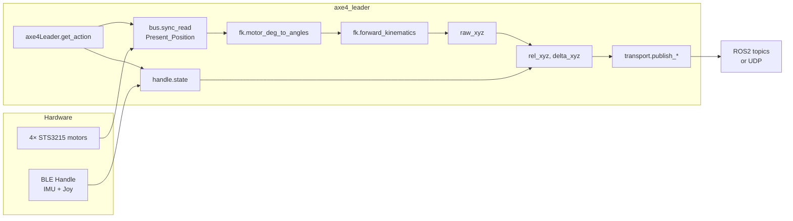
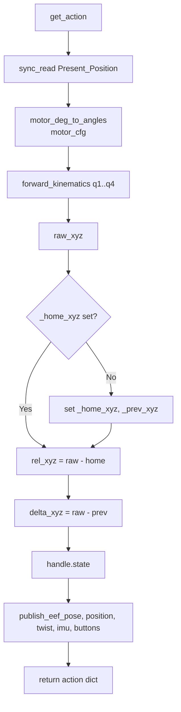
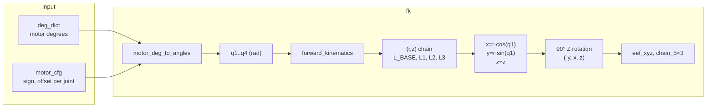
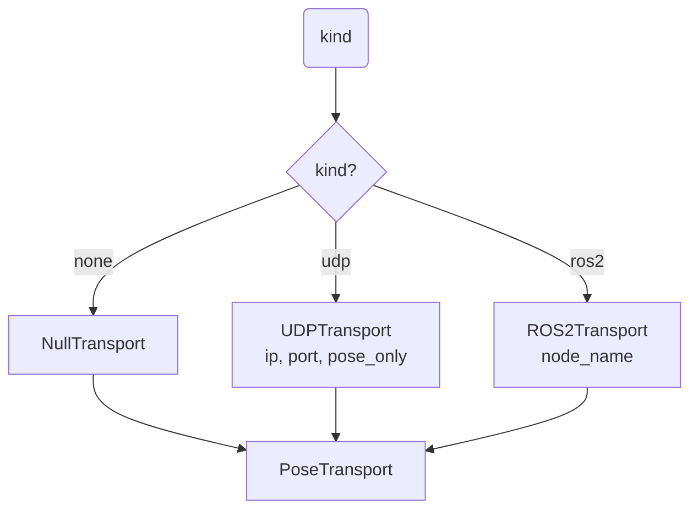

# AXE4 Leader — Package overview and flow

Teleoperator: 4× Feetech STS3215 motors (arm) + BLE handle (IMU + joystick). Pose from planar FK; orientation from handle quaternion. Outputs: eef_pose, eef_position, eef_twist, imu, joy (ROS2 or UDP).

---

## File roles

| File | Role |
|------|------|
| `axe4_leader.py` | Main teleoperator: bus + handle + transport; `get_action()` runs FK and publishes. |
| `fk.py` | Planar 3-link + pan FK; motor_cfg load; no URDF. |
| `config_axe4_leader.py` | Config: port, handle_source, transport, UDP/ROS2 options. |
| `handle_reader.py` | BLE (HandleReader) or UDP (LegacyIMUReader) for IMU + joystick. |
| `transport/base.py` | Abstract `PoseTransport`; `NullTransport` no-op. |
| `transport/ros2_transport.py` | Publishes PoseStamped, TwistStamped, Imu, Joy. |
| `transport/udp_transport.py` | Sends pose (and optionally other) packets over UDP. |
| `transport/__init__.py` | `create_transport("ros2"\|"udp"\|"none", **kwargs)`. |

---

## Overall data flow

---

## get_action() flow (axe4_leader.py)

---

## FK pipeline (fk.py)

- **motor_cfg**: loaded from `src/axe4/config/axe4_axis_calibration.json` (key `motor_cfg`) or defaults.
- **forward_kinematics**: builds planar chain in (r,z), sweeps by pan q1, then applies 90° rotation so arch is in XZ (forward) plane.
- **Frame**: +X forward, +Y left, Z up.

---

## Transport selection

---

## Key classes

- **axe4Leader** (axe4_leader.py): Connects bus, handle, transport; `connect()` / `get_action()` / `disconnect()`. First `get_action()` sets home; subsequent ones publish rel_xyz and delta_xyz.
- **HandleReader** (handle_reader.py): BLE thread; exposes `state` (roll, pitch, yaw, quat, joy, buttons). **LegacyIMUReader**: UDP fallback, quat only.
- **PoseTransport** (transport/base.py): Interface for publish_eef_pose, publish_eef_position, publish_eef_twist, publish_imu, publish_buttons.
